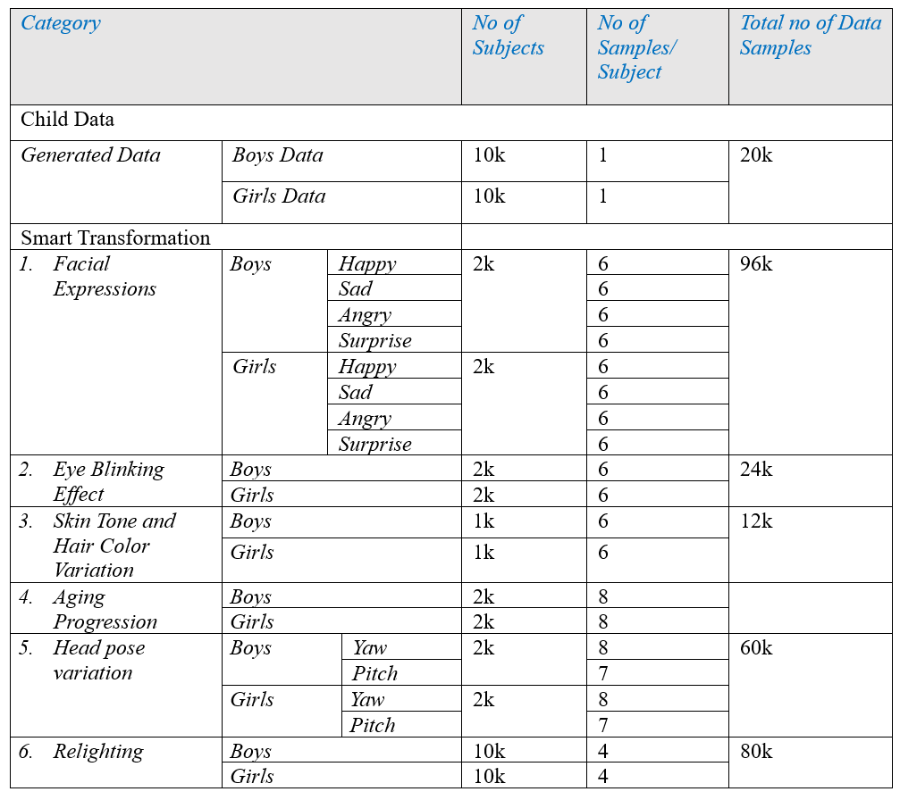
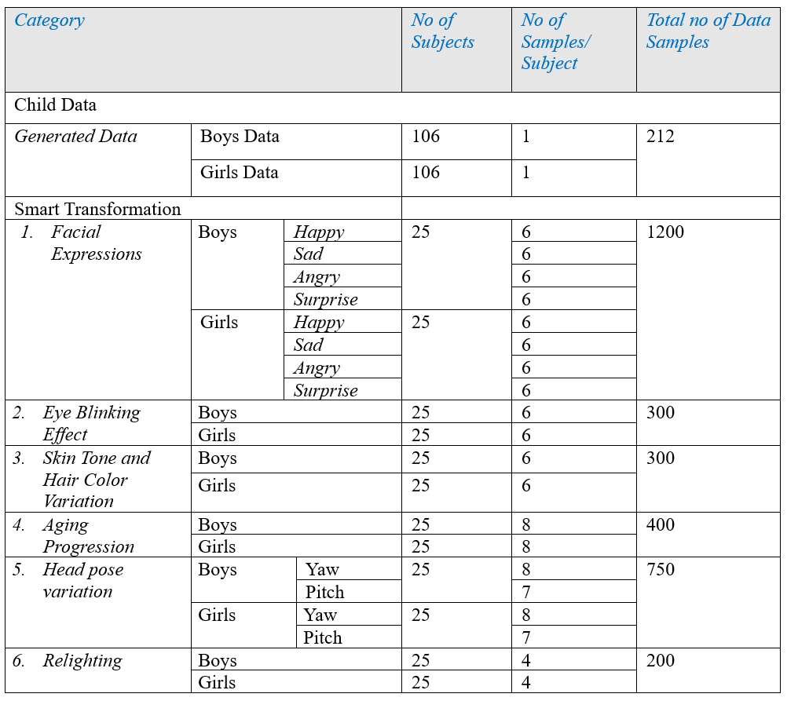

# ChildGAN
ChildGAN

# Large Scale Synthetic Child Data Generated via ChildGAN

This repo contains all the codes. trained models, and link to downlaod complete genereted dataset with six different smart transformations.

The complete styleGAN2 repository can be downloaded from the below link.
Link: https://github.com/NVlabs/stylegan2-ada-pytorch

1.	The complete dataset along the trained models are open sourced and can be used to generate further synthetic child data samples.

2.	The overall ChildGAN dataset structure is provided in the table below.

3. In addition to the complete dataset, we have also released a small subset of this dataset which can be downloaded for validation purposes. The dataset attributes and folder structures of subset dataset is provided below. 

4.	For further queries please reach us at following email address 
--
*Email 1: mali.farooq@outlook.com* 
*Email 2: yaowang_1994@outlook.com*

Thank you.

Regards
Dr Muhammad Ali Farooq
University of Galway
Ireland 

