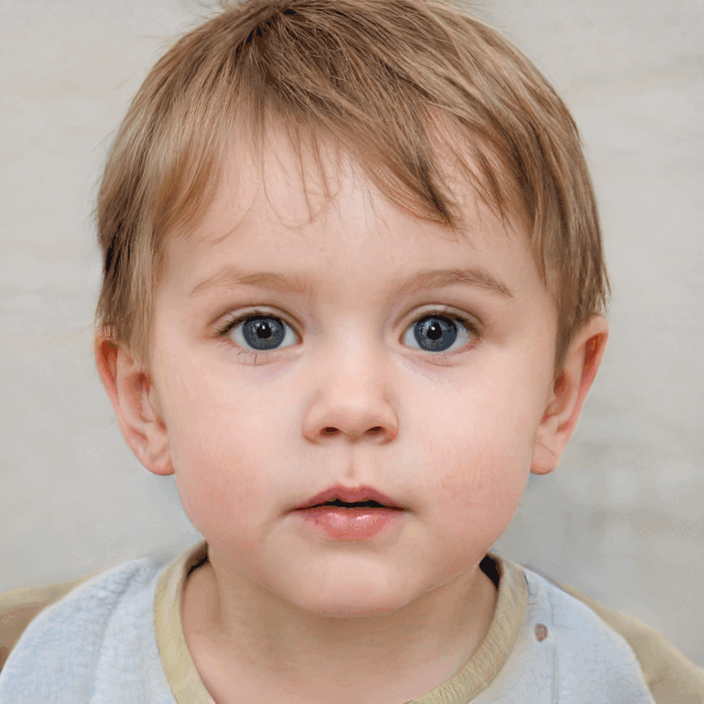

# ChildGAN


<video src="video/ChildGAN_Final_Video.mp4" controls="controls" width="500" height="300"></video>


```HTML
<video width="320" height="240" controls>
    <source src="video/ChildGAN_Final_Video.mp4" type="video/mp4">
</video>
```

ChildGAN

This is the link of dataset samples: https://drive.google.com/file/d/1oU-6DbwmtiUOokdZtEuCgB8p6TVPRb21/view?usp=share_link

This is the link of whole dataset: https://drive.google.com/drive/folders/1QPTI9Sd4TXTcQWbTEojv6pdWBxlVd1n1?usp=share_link

# Large Scale Synthetic Child Data Generated via ChildGAN


This repo contains all the codes. trained models, and link to downlaod complete genereted dataset with six different smart transformations. In this work we have incorparetd six differet smart facial transoformations which include four different facial expressions, eye blinking effect, hair and skin color digitization, aging, facial yaw and pitch variation and varoius ligting conditions.

1. Boy Pitch Transformation


2. Boy Yaw Transformation


3. Boy Age Transformation


4. Boy Expressions Transformation


5. Boy Eye Blinking Transformation



6. Boy Hair and Skin Color Transformation


7. Boy Lighting Transformation


8. Girl Pitch Transformation


9. Girl Age Transformation


10. Girl Eye Blinking Transformation


11. Girl Expressions Transformation


12. Girl Hair and Skin Color Transformation


13. Girl Lighting Transformation


14. Girl Yaw Transformation


The complete styleGAN2 repository can be downloaded from the below link.
Link: https://github.com/NVlabs/stylegan2-ada-pytorch

1.	The complete dataset along the trained models are open sourced and can be used to generate further synthetic child data samples.

2.	The overall ChildGAN dataset structure is provided in the table below.


3. In addition to the complete dataset, we have also released a small subset of this dataset which can be downloaded for validation purposes. The dataset attributes and folder structures of subset dataset is provided below. 


4.	For further queries please reach us at following email address.


Email 1: mali.farooq@outlook.com 

Email 2: yaowang_1994@outlook.com


Note: The following environment will need the mentioned dependencies.
1. python3.6 
2. tensorflow 1.14

Thank you.

Regards 

Dr Muhammad Ali Farooq 


University of Galway 


Ireland 

